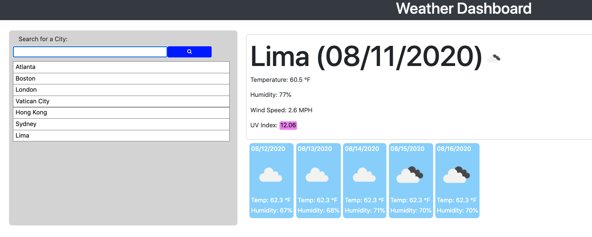

# Weather Dashboard
An API based simple weather information dashboard.

https://n-lambert.github.io/WeatherDashboard/

Table of Contents:

- [Section 1: Introduction](#introduction)
- [Section 2: Usage](#usage)
- [Section 3: Credits](#credits)
- [Section 4: License](#license)

## Introduction ##

This weather dasboard gets current weather, forecast data and uv index from the openweathermap api via AJAX, JQuery and JS. It uses three APIs from openweathermap: 
- Current weather: https://openweathermap.org/api
- UV Index: https://openweathermap.org/api/uvi
- 5 day forecast: https://openweathermap.org/forecast5

 It also utilizes bootstrap and css to make the application responsive.

## Usage ##

The source files for this quiz can be accessed through cloning the GitHub repo. The link above will take you to the deployed project.
To generate the data, enter a city in the search form on the site.

## Credits ##

Sun image by Editor at Large - Own work, CC BY-SA 3.0, https://commons.wikimedia.org/w/index.php?curid=2200438

Many thanks to my coding co-op for sharing ideas and commiserating on frustrations:

- [Zachary Bryan](https://github.com/zacharybryan)
- [Tim Sanders](https://github.com/tbsanders5)
- [Nick Konzen](https://github.com/NTKonzen)
- [Kira Bismuth Lowrey](https://github.com/KILowrey)
- [Nancy Lambert-Brown](https://github.com/n-lambert)
- [Mando Estrada](https://github.com/Mando619)
- [Talia Vazquez](https://github.com/taliavazquez)
- [Perry Theobald](https://github.com/perrytjr)
- [Jeneth Diestra](https://github.com/jen6one9)
- [Matthew Rogers](https://github.com/Rogers-Development-Services)
- [Jefrrey Choi](https://github.com/jepoy92)
- [Clyde Baron Rapinan](https://github.com/clydebaron2000)
- [Johnny Lieu](https://github.com/johnnylieu)
- [Robert Graham](https://github.com/Robmgraham)

## License ##

GNU General Public License
